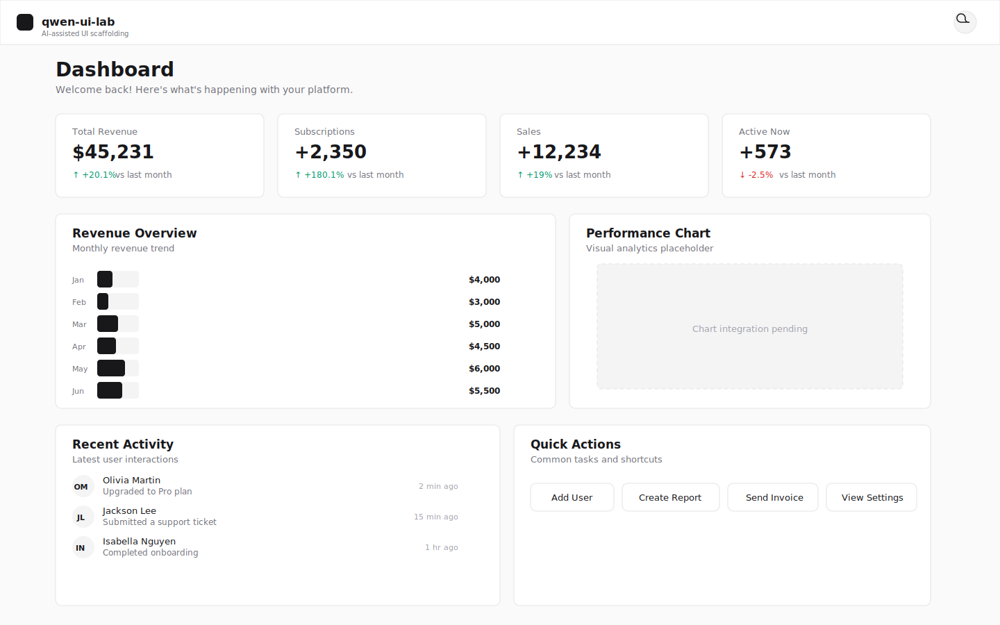
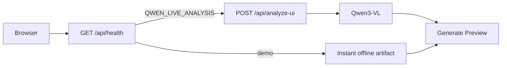

# qwen-ui-lab

**AI-assisted UI scaffolding** — turn UI screenshots into React + Tailwind starting points you can refine in minutes.

[-amber)](https://qwen-ui-lab.vercel.app)
[](https://nextjs.org/)
[](https://react.dev/)
[](https://www.typescriptlang.org/)
[](https://github.com/Iron-Mark/qwen-ui-lab/releases/tag/v0.1.2)

> **Pitch (matches the live app):** Turn UI screenshots into React + Tailwind scaffolds with Qwen3-VL and Qwen Code—**offline-safe by default** for meetups.  
> On `/`: hero → upload flow → dashboard charts; polish in `/design-system`.

| | |
|---|---|
| **Repository** | [github.com/Iron-Mark/qwen-ui-lab](https://github.com/Iron-Mark/qwen-ui-lab) |
| **Production** | **[qwen-ui-lab.vercel.app](https://qwen-ui-lab.vercel.app)** |
| **Latest release** | [v0.1.2](https://github.com/Iron-Mark/qwen-ui-lab/releases/tag/v0.1.2) |

---

## Live demo

**[Open the live demo →](https://qwen-ui-lab.vercel.app)**

No API key required — the public site runs **offline demo analysis** by default. On first visit you’ll see the bottom-left **Demo mode — safe for live demos** snackbar (once per session).

| Preview | Where |
|--------|--------|
| Social / OG | Production serves `/opengraph-image` and `/twitter-image` (generated by Next.js) |
| PWA icons | `public/icons/` — `icon.svg`, `icon-192.png`, `icon-512.png`, `apple-touch-icon.png` (see `manifest.json`) |
| README embeds | Checked-in reference SVGs below (optional PNGs under `public/screenshots/`) |



---

## What it does (meetup audience)

- **Screenshot → analyze → scaffold** — upload (or **Use sample screenshot**), run **Analyze**, then **Generate Preview** for React/Tailwind output with copy/export.
- **Demo-safe by default** — instant offline analysis; live Qwen vision is opt-in (`QWEN_LIVE_ANALYSIS=true`).
- **Design system lab** — atomic catalog at `/design-system` with search, filters, variant toggles, and **Export all snippets**.
- **UX literacy built in** — [Laws of UX](https://lawsofux.com) compliance dialog on analyze/generate; domain filters for Laws of UX and UI Laws patterns.
- **Polish without a redesign** — brand themes (Indigo / Emerald / Sunset), light/dark mode, themed Recharts + Chart.js dashboard on `/`.

**Value props (same language as the home UI)**

| Surface | Copy |
|---------|------|
| Site tagline | AI-assisted UI scaffolding |
| Header | AI UI Studio |
| Upload flow | Upload screenshot to component preview |
| Upload subcopy | Ideal for rapid design reviews: analyze one screenshot, generate a scaffold, then reuse exported snippets across your next sprint. |
| Growth line | Launch faster with a screenshot-to-scaffold loop. |

---

## Quick start

```bash
git clone https://github.com/Iron-Mark/qwen-ui-lab.git
cd qwen-ui-lab
npm ci
npm run dev
```

Open [http://localhost:3000](http://localhost:3000).

**Environment (demo default = none)**

| Variable | Demo (default) | Live (opt-in) |
|----------|----------------|---------------|
| `DASHSCOPE_API_KEY` | unset | your Model Studio key |
| `QWEN_LIVE_ANALYSIS` | unset / false | `true` (alias `USE_LIVE_QWEN=1`) |

Copy [`.env.example`](./.env.example) to `.env.local` only when testing live vision. **A key alone does not enable live calls.**

Optional: `npm run doctor` for env, deps, and API ping when a key is set.

---

## Key routes

| Route | Purpose |
|-------|---------|
| `/` | Dashboard + **UploadFlow** (screenshot → analyze → generate preview) |
| `/design-system` | Atomic component catalog, filters, export bundle |
| `/design-system?domain=laws-of-ux` | Laws of UX pattern slice |
| `/design-system?domain=uilaws` | UI Laws–informed patterns |
| `/design-system/laws-of-ux` | Redirects to `?domain=laws-of-ux` |
| `GET /api/health` | Provider probe (`demo` vs live analysis enabled) |
| `POST /api/analyze-ui` | Vision analysis (skipped in demo mode on client) |

---

## Demo flow (30-second presenter script)

Use this on stage; full click-by-click notes live in **[DEMO.md](./DEMO.md)**.

1. Open **[qwen-ui-lab.vercel.app](https://qwen-ui-lab.vercel.app)** — point out header **Demo mode** and the bottom-left offline-tour snackbar.
2. Click **Use sample screenshot** → **Analyze** (instant offline path; no API wait).
3. **Generate Preview** — reference vs plan cards, scaffold + stats.
4. Jump to **Design system** — filter, toggle variants, mention **Laws of UX** dialog from analyze flow.
5. Toggle **brand theme** + light/dark — charts follow tokens.

**One-liner for the room:** *“Turn screenshots into production-ready React/Tailwind starting points — demo runs offline; live Qwen is one env flag when you’re ready.”*

---

## Architecture

**Stack:** Next.js App Router · React · TypeScript · Tailwind CSS v4 · shadcn/ui · Recharts + Chart.js · Qwen3-VL (optional)



**Folder map**

```
src/app/              routes + API (analyze-ui, health)
src/components/
  ui/                 shadcn primitives
  atoms|molecules|organisms/   product UI + UploadFlow
  design-system/      catalog chrome
src/lib/              analyze, ui-flow, sessions, SEO
docs/                 operator + design docs (see table below)
e2e/                  Playwright smoke (mocked analyze)
tests/                Node unit tests
```

Atomic tiers and catalog conventions: **[docs/ATOMIC_DESIGN.md](./docs/ATOMIC_DESIGN.md)** · runtime boundaries: **[docs/ARCHITECTURE_OVERVIEW.md](./docs/ARCHITECTURE_OVERVIEW.md)**

---

## Scripts

| Script | What it does |
|--------|----------------|
| `npm run dev` | Local Next.js dev server |
| `npm run check` | Lint + unit tests |
| `npm run check:full` | `check` + production build |
| `npm run build` | Production build |
| `npm test` | Node unit tests (`tests/*.test.mjs`) |
| `npm run lint` | ESLint |
| `npm run test:e2e` | Playwright smoke (offline mocks; no live Qwen) |
| `npm run test:e2e:visual` | Visual regression spec only (CI gate on `main`) |
| `npm run export:demo-fixtures` | Regenerate `e2e/fixtures/demo-responses.json` from demo libs |
| `npm run doctor` | Env, deps, optional API ping |
| `npm run validate:assets` | Public/manifest icon paths and size budget (CI) |
| `npm run synthetic:health` | `/api/health` probe + latency thresholds |
| `npm run smoke:deploy` | Post-deploy route smoke (`DEPLOY_URL=…`) |
| `npm run deploy:env:demo` | Validate demo-safe deploy env |
| `npm run deploy:env:live` | Validate live-analysis deploy env |
| `npm run perf:lighthouse` | Lighthouse run (see script for baseline/after) |
| `npm run perf:lcp-budget` | Production LCP budget check (warn-only in CI) |

---

## Deployment

**Host:** [Vercel](https://vercel.com) — production URL **[https://qwen-ui-lab.vercel.app](https://qwen-ui-lab.vercel.app)**

| Policy | Command / doc |
|--------|----------------|
| Demo-safe production (default) | `npm run deploy:env:demo` · **[docs/PRODUCTION_DEPLOY_LANE.md](./docs/PRODUCTION_DEPLOY_LANE.md)** |
| Live Qwen staged rollout | **[docs/LIVE_QWEN_ROLLOUT.md](./docs/LIVE_QWEN_ROLLOUT.md)** · `npm run deploy:env:live` |
| Pre/post release checklist | **[docs/DEPLOYMENT_CHECKLIST.md](./docs/DEPLOYMENT_CHECKLIST.md)** |
| After go-live (operators) | **[docs/POST_LAUNCH.md](./docs/POST_LAUNCH.md)** |

Post-deploy smoke:

```bash
DEPLOY_URL=https://qwen-ui-lab.vercel.app npm run smoke:deploy
```

---

## Safety: demo vs live

| Mode | `QWEN_LIVE_ANALYSIS` | Behavior |
|------|----------------------|----------|
| **Demo (default)** | unset / false | `GET /api/health` → `provider: demo`; client uses **instant offline** artifact — no upstream Qwen spend |
| **Live** | `true` + `DASHSCOPE_API_KEY` | Header **Live Qwen**; image preprocess → `POST /api/analyze-ui` → Qwen3-VL |

Never put API keys in `NEXT_PUBLIC_*`. Public meetup demos should keep **`QWEN_LIVE_ANALYSIS` unset** on Vercel.

E2E always forces demo behavior via mocks — see **[DEMO.md](./DEMO.md)** and `e2e/helpers/mock-analyze-api.ts`.

---

## Contributing, license & security

See **[CONTRIBUTING.md](./CONTRIBUTING.md)** for branch workflow, commands, and PR expectations. Open issues and PRs on [Iron-Mark/qwen-ui-lab](https://github.com/Iron-Mark/qwen-ui-lab).

- **License:** [MIT](./LICENSE) (see also `license` in [package.json](./package.json))
- **Security:** report vulnerabilities via [`.github/SECURITY.md`](./.github/SECURITY.md) — do not post API keys or secrets in public issues

---

## Documentation index

Presenter and marketing-adjacent docs:

| Doc | Audience |
|-----|----------|
| **[DEMO.md](./DEMO.md)** | Meetup script, pre-flight checklist, what to say about the API |
| **[docs/POST_LAUNCH.md](./docs/POST_LAUNCH.md)** | Demo operators after production deploy |
| **[docs/DEPLOYMENT_CHECKLIST.md](./docs/DEPLOYMENT_CHECKLIST.md)** | Release deploy steps |
| **[docs/RELEASE_NOTES_DRAFT.md](./docs/RELEASE_NOTES_DRAFT.md)** | Release notes source (tag on publish) |

Engineering & ops:

| Doc | Topic |
|-----|--------|
| [docs/ATOMIC_DESIGN.md](./docs/ATOMIC_DESIGN.md) | Folder tiers, catalog domains |
| [docs/ARCHITECTURE_OVERVIEW.md](./docs/ARCHITECTURE_OVERVIEW.md) | Runtime architecture |
| [docs/CI.md](./docs/CI.md) | GitHub Actions (PR checks, nightly E2E, visual gate, LCP budget) |
| [docs/OFFLINE_DEMO_E2E.md](./docs/OFFLINE_DEMO_E2E.md) | Offline demo algorithm + E2E guarantee (no AI) |
| [docs/PWA.md](./docs/PWA.md) | Install, offline shell, service worker updates |
| [docs/PRODUCTION_DEPLOY_LANE.md](./docs/PRODUCTION_DEPLOY_LANE.md) | Env policy gates, smoke hooks |
| [docs/LIVE_QWEN_ROLLOUT.md](./docs/LIVE_QWEN_ROLLOUT.md) | Live Qwen env, `deploy:env:live`, smoke, rollback |
| [docs/RELEASE_PROCESS.md](./docs/RELEASE_PROCESS.md) | Versioning and release flow |
| [docs/RELEASE_PACKAGE_CHECKLIST.md](./docs/RELEASE_PACKAGE_CHECKLIST.md) | Tag and release commands |
| [docs/TROUBLESHOOTING_RUNBOOK.md](./docs/TROUBLESHOOTING_RUNBOOK.md) | Incidents and fixes |
| [docs/RELIABILITY_OPS.md](./docs/RELIABILITY_OPS.md) | Synthetic checks, SLOs |
| [docs/ANALYTICS_TAXONOMY.md](./docs/ANALYTICS_TAXONOMY.md) | Privacy-safe analytics events |
| [docs/EXPERIMENTATION.md](./docs/EXPERIMENTATION.md) | Feature flags / A/B |
| [docs/ANALYTICS_STAGING_ACTIVATION.md](./docs/ANALYTICS_STAGING_ACTIVATION.md) | Staging-only telemetry |
| [docs/CSP_HARDENING_GUIDE.md](./docs/CSP_HARDENING_GUIDE.md) | CSP report-only rollout |
| [docs/ROLLBACK_CHECKLIST.md](./docs/ROLLBACK_CHECKLIST.md) | Rollback steps |
| [docs/STORYBOOK.md](./docs/STORYBOOK.md) | Deferred Storybook note |

**Releases:** [GitHub Releases](https://github.com/Iron-Mark/qwen-ui-lab/releases) · current **[v0.1.2](https://github.com/Iron-Mark/qwen-ui-lab/releases/tag/v0.1.2)**

---

## Final takeaway

AI helps with decomposition and scaffolding; it does not replace front-end judgment. Ship faster with a screenshot-to-scaffold loop — keep the public demo offline unless you explicitly opt into live analysis.
