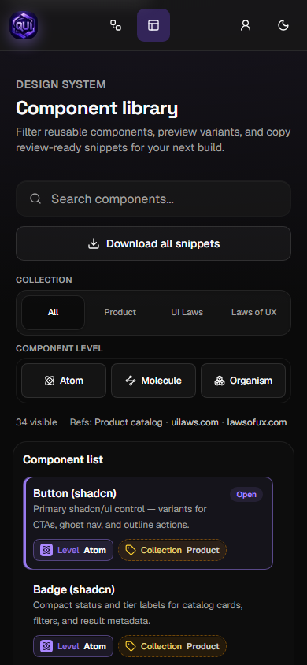

# qwen-ui-lab

Turn UI screenshots into inspectable React + Tailwind export packages.

`qwen-ui-lab` is a browser-first workflow for product and frontend reviews: upload a screenshot, inspect detected UI structure, correct detection boxes, preview a component draft, then download a starter package with code, design notes, tokens, recipe JSON, and detection notes.

Production: [qwen-ui-lab.vercel.app](https://qwen-ui-lab.vercel.app)

## Product Preview

| Workflow | Design system |
| --- | --- |
|  |  |

## What It Does

- Upload PNG, JPG, SVG, or WebP UI screenshots.
- Run local analysis by default, without requiring a paid vision provider.
- Inspect detected sections, cards, forms, tables, dialogs, navbars, tabs, charts, and mobile shells.
- Edit detection boxes before rebuilding the preview.
- Review confidence reasons for detected elements.
- Generate a React + Tailwind component draft with shadcn-style primitive mapping.
- Export a multi-file starter package for review or handoff.
- Browse reusable product and UX-law snippets in the design system.

## Visual Archive


The repository includes a LexInsights-style archive of real product screenshots captured from the local app. Open [docs/SCREENSHOTS.md](docs/SCREENSHOTS.md) for the full feature-by-feature catalog.

- Device showcase: [public/mock-ups/A1-device-showcase.png](public/mock-ups/A1-device-showcase.png)
- Feature gallery: [public/mock-ups/A2-feature-gallery.png](public/mock-ups/A2-feature-gallery.png)
- Theme and viewport matrix: [public/mock-ups/A3-theme-viewport-matrix.png](public/mock-ups/A3-theme-viewport-matrix.png)
- PWA desktop screenshot: [public/screenshots/A1-Workflow-Home/desktop-light.png](public/screenshots/A1-Workflow-Home/desktop-light.png)
- PWA mobile screenshot: [public/screenshots/A2-Upload-Flow/mobile-light.png](public/screenshots/A2-Upload-Flow/mobile-light.png)

## Quick Start

```bash
npm ci
npm run dev
```

Open the local URL printed by Next.js, usually [http://localhost:3000](http://localhost:3000). If that port is busy, use the alternate port shown in the terminal.

Local analysis is the default. A Qwen API key alone does not enable upstream calls.

## Optional Live Vision

Live Qwen analysis is opt-in and requires both server-side configuration and an explicit live flag:

```bash
DASHSCOPE_API_KEY=<your-key>
QWEN_LIVE_ANALYSIS=true
```

Never expose provider secrets through `NEXT_PUBLIC_*` variables.

## Main Routes

| Route | Purpose |
| --- | --- |
| `/` | Upload, detect, refine, preview, share, and package download workflow. |
| `/demo` | Guided sample run for seeded UI screenshots. |
| `/design-system` | Component catalog with product and UX-law references. |
| `/account` | Compatibility redirect to the browser-local profile modal. |
| `/share/[id]` | Read-only shared analysis summary. |

## Starter Package Contents

Downloaded packages are intended as inspectable starter packages, not finished screens. A package can include:

- `README.md`
- `DESIGN.md`
- component draft TSX
- recipe JSON
- manifest JSON
- tokens CSS
- detection notes markdown

## E2E Review

Use these before opening or updating a PR:

```bash
npm run check
npm run check:screenshots
npm run validate:docs
npm run validate:assets
npm run deploy:env:local-analysis
npm run build
```

For browser-facing changes, also run:

```bash
npm run test:e2e:visual
npm run test:e2e
npm run test:e2e:pwa
```

`npm run check:full` runs lint, unit tests, screenshot archive validation, docs link validation, and the production build.

## Refresh Screenshots

Use a production preview when refreshing committed screenshots so development-only chrome does not appear in README, manifest, or archive images.

```bash
npm run build
npm run start -- -p 3001
```

In a second terminal:

```bash
npm run capture:screenshots -- --base-url http://localhost:3001
npm run check:screenshots
```

Before committing refreshed screenshots, visually confirm there are no Next.js dev badges, toast overlays, local file paths, private tokens, debug dialogs, or stale theme colors.

## Documentation

Start with [docs/README.md](docs/README.md) for the full documentation index, architecture notes, operations guides, visual archive, and release process.

## License

MIT. See [LICENSE](LICENSE).
