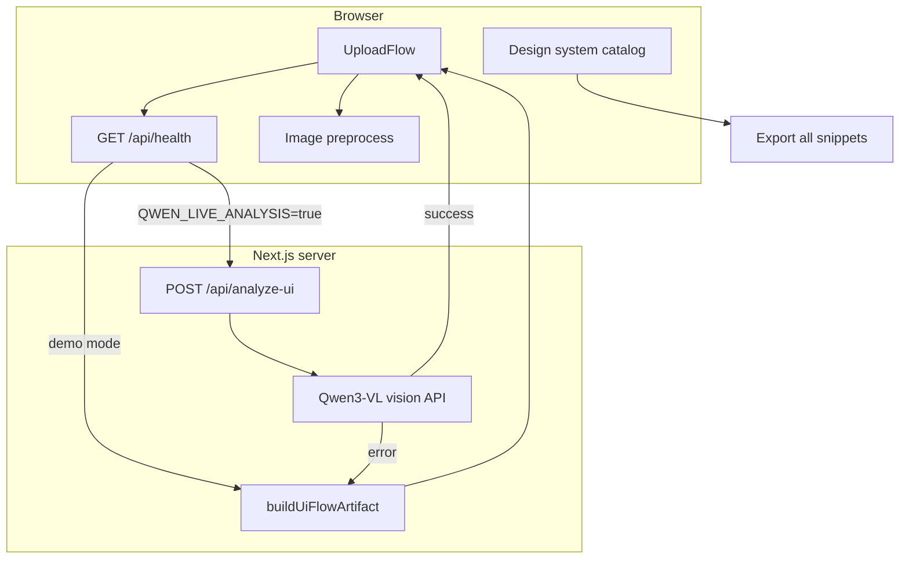

# qwen-ui-lab

An AI-assisted workflow for converting UI screenshots into React/Tailwind component scaffolds using Qwen3-VL and Qwen Code.

## Links

- Repository: [github.com/Iron-Mark/qwen-ui-lab](https://github.com/Iron-Mark/qwen-ui-lab)
- Live demo: [qwen-ui-lab.vercel.app](https://qwen-ui-lab.vercel.app)
- **[DEMO.md](./DEMO.md)** — live presentation script and pre-flight checklist
- **[docs/ATOMIC_DESIGN.md](./docs/ATOMIC_DESIGN.md)** — folder tiers, catalog domains, how to add components

## Goal

Test whether Qwen can help shorten the front-end workflow from visual reference to usable component structure.

## Architecture



## Presenting live

See **[DEMO.md](./DEMO.md)** for a 30-second setup, click-by-click script, and pre-flight checklist. No API key is required — Analyze uses **instant offline demo** unless `QWEN_LIVE_ANALYSIS=true` is set (API key alone does not enable live calls).

## Live Demo Flow

1. Upload or drag in a UI screenshot, or click **Use sample screenshot**.
2. **Analyze** — health check → instant demo or live Qwen (with image resize/compress + retry).
3. Split view: reference screenshot vs plan cards; **Generate Preview** for scaffold + stats.
4. Copy/export generated code; sessions saved in localStorage.
5. Browse `/design-system` for atomic catalog, search/filter, variant toggles, and bundle export.
6. Explore `/design-system/laws-of-ux` for interactive [Laws of UX](https://lawsofux.com) demos (Jon Yablonski); analyze/generate shows an automated compliance checklist.
7. Browse `/design-system?domain=uilaws` for [UI Laws](https://www.uilaws.com)–informed patterns (unified atomic catalog).

## Screenshots

| Flow | Path |
|------|------|
| Upload + analyze | `/` — UploadFlow with session history |
| Generated scaffold | `/` — after **Generate Preview** |
| Design system | `/design-system` — unified atomic catalog (product + UILaws + Laws of UX) |
| Laws of UX filter | `/design-system?domain=laws-of-ux` |
| UILaws filter | `/design-system?domain=uilaws` |
| Charts (themed) | `/` dashboard — Recharts + Chart.js |

_Add your own PNGs under `public/screenshots/` for README embeds._

## Qwen API Environment

Copy `.env.example` to `.env.local` for local development.

**Demo mode (default):** leave `QWEN_LIVE_ANALYSIS` unset. Analyze uses instant offline demo data — no upstream Qwen calls, even if `DASHSCOPE_API_KEY` is present.

**Live Qwen (opt-in, spends credits):**

```bash
DASHSCOPE_API_KEY=<your-model-studio-api-key>
QWEN_LIVE_ANALYSIS=true
QWEN_MODEL=qwen3-vl-plus
QWEN_BASE_URL=https://dashscope-intl.aliyuncs.com/compatible-mode/v1
```

Alias: `USE_LIVE_QWEN=1`. Do not use `NEXT_PUBLIC_` for the API key. The key must stay server-only.

Dev boot logs env warnings via `instrumentation.ts`. Run `npm run doctor` for env, deps, and optional API ping.

## Project Structure

```
src/
  app/
    api/analyze-ui/   — Qwen vision route
    api/health/       — Provider / API-key probe
  components/
    ui/               — shadcn/ui primitives (Button, Card, Badge, Sonner, …)
    atoms/            — Product atoms composing ui/
    molecules/        — Composed widgets
    organisms/        — UploadFlow, Header, dashboard sections
    design-system/    — Catalog chrome (preview cards, filters)
    providers/        — Theme, toast shim, error boundary
    charts/           — Recharts + Chart.js with shared theme tokens
  lib/                — analyze-outcome, ui-flow, image preprocess, session history
tests/                — Node unit tests
e2e/                  — Playwright smoke (upload → analyze → generate)
public/
  manifest.json       — PWA manifest
  sw.js               — Minimal service worker (production)
docs/
  ATOMIC_DESIGN.md    — Atomic tiers + shadcn/ui conventions
  STORYBOOK.md        — Deferred Storybook note
```

## Getting Started

```bash
npm install
npm run dev
```

Open [http://localhost:3000](http://localhost:3000).

## Verification

```bash
npm test
npm run lint
npm run build
npm run doctor      # env + deps (+ API ping when key set)
npm run test:e2e    # Playwright smoke
```

### E2E (no live Qwen)

Playwright smoke tests do **not** call the Qwen API:

- `e2e/helpers/mock-analyze-api.ts` intercepts `GET /api/health` (`liveAnalysisEnabled: false`) and `POST /api/analyze-ui` so Analyze always uses the **instant offline demo** path, even if `DASHSCOPE_API_KEY` or `QWEN_LIVE_ANALYSIS` is set in `.env.local` or CI.
- `playwright.config.ts` starts `npm run dev` with `DASHSCOPE_API_KEY` and `QWEN_LIVE_ANALYSIS` unset so the server health route matches demo mode when mocks are not hit.

No extra CI secrets are required for e2e.

CI runs test, lint, build, and e2e on push/PR (see `.github/workflows/ci.yml`).

## UX references

- **[Laws of UX](https://lawsofux.com)** (Jon Yablonski) — canonical ergonomics/perception laws; integrated in `/design-system/laws-of-ux` with live demos and analyze/generate compliance heuristics.
- **[UI Laws](https://www.uilaws.com)** — complementary visual-design principles; overlaps (Fitts, Hick, Jakob) cross-link to Laws of UX in-app.

## Tech Stack

- [Next.js](https://nextjs.org/) (App Router)
- [React](https://react.dev/)
- [TypeScript](https://www.typescriptlang.org/)
- [Tailwind CSS](https://tailwindcss.com/) v4
- [shadcn/ui](https://ui.shadcn.com) — Button, Card, Badge, Tabs, Sonner, and other primitives under `src/components/ui/`
- [Recharts](https://recharts.org/) + [Chart.js](https://www.chartjs.org/)
- [Prism](https://prismjs.com/) — snippet syntax highlighting

## Final Takeaway

AI is useful for decomposition and scaffolding. It is not a replacement for front-end judgment.
