# Product Screenshot Archive

This archive mirrors the current qwen-ui-lab product UI from local captures. Images are generated from the running app with `npm run capture:screenshots -- --base-url http://localhost:3001`, then checked with `npm run check:screenshots`.

## Mockup Boards

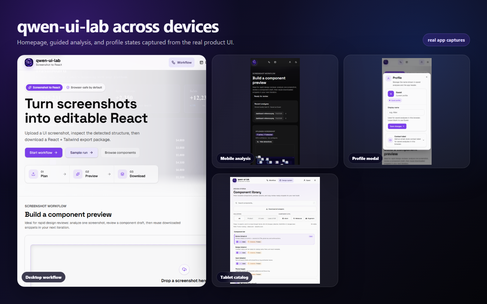
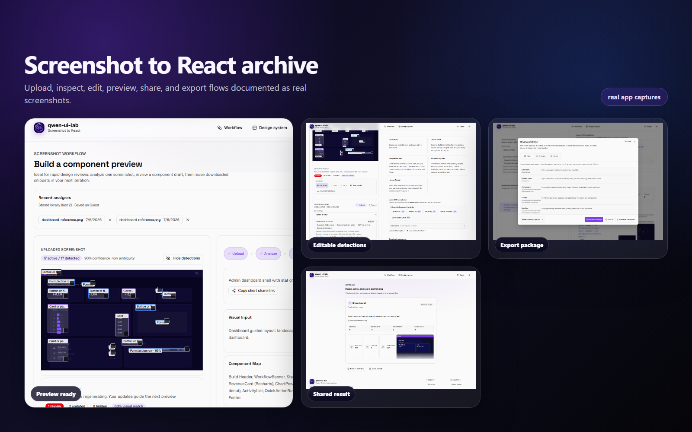
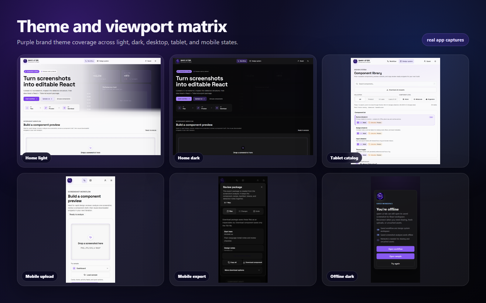

## A1 - Workflow Home

The primary screenshot-to-React entry point across desktop, tablet, mobile, light, and dark states.

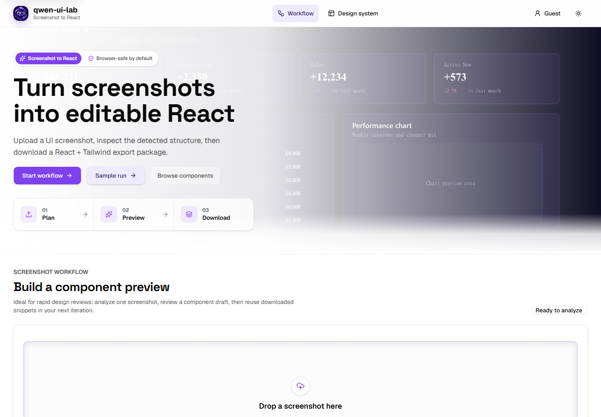

- [Desktop light](../public/screenshots/A1-Workflow-Home/desktop-light.png)
- [Desktop dark](../public/screenshots/A1-Workflow-Home/desktop-dark.png)
- [Tablet light](../public/screenshots/A1-Workflow-Home/tablet-light.png)
- [Mobile dark](../public/screenshots/A1-Workflow-Home/mobile-dark.png)

## A2 - Upload Flow

The focused upload surface before analysis, including the mobile entry state used by the PWA manifest.

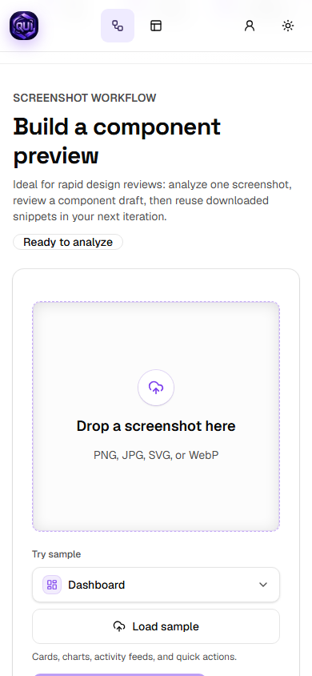

- [Desktop light](../public/screenshots/A2-Upload-Flow/desktop-light.png)
- [Tablet dark](../public/screenshots/A2-Upload-Flow/tablet-dark.png)
- [Mobile light](../public/screenshots/A2-Upload-Flow/mobile-light.png)

## A3 - Post Analysis

The analysis-complete workspace with guided steps, preview status, and package review actions.

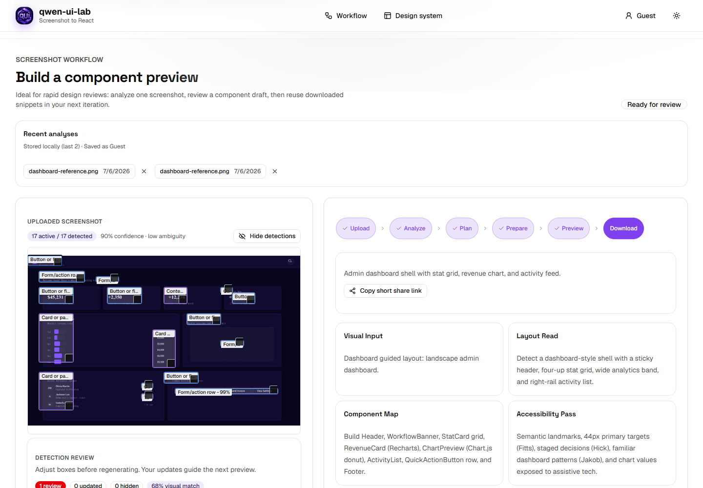

- [Desktop light](../public/screenshots/A3-Post-Analysis/desktop-light.png)
- [Desktop dark](../public/screenshots/A3-Post-Analysis/desktop-dark.png)
- [Mobile dark](../public/screenshots/A3-Post-Analysis/mobile-dark.png)

## A4 - Detector Editor

Editable detection boxes, confidence reasons, and correction controls.

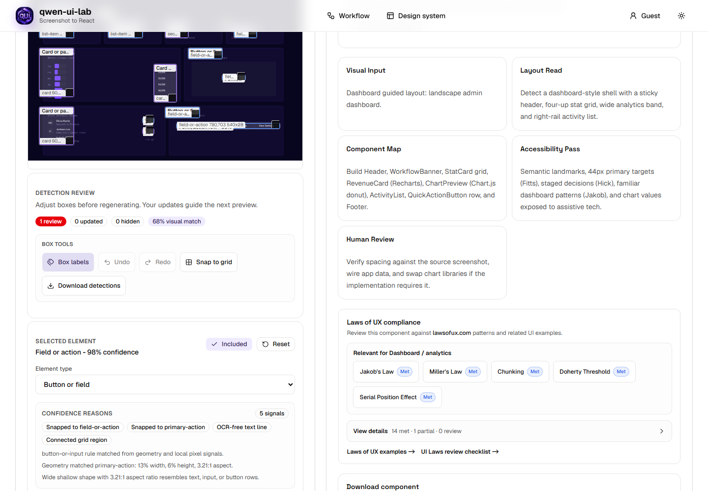

- [Desktop light](../public/screenshots/A4-Detector-Editor/desktop-light.png)
- [Mobile light](../public/screenshots/A4-Detector-Editor/mobile-light.png)

## A5 - Export Package

The package review dialog with file previews, change summary, and download actions.

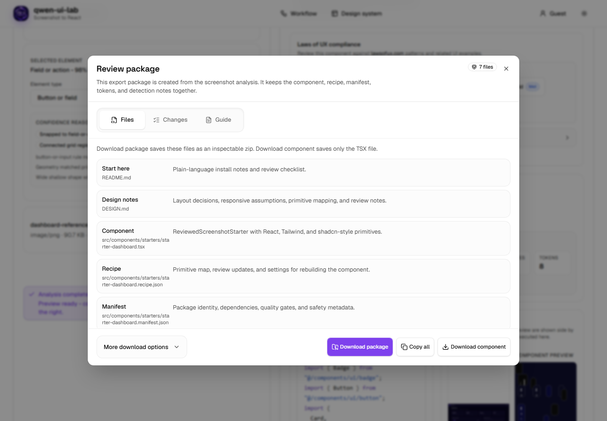

- [Desktop light](../public/screenshots/A5-Export-Package/desktop-light.png)
- [Mobile dark](../public/screenshots/A5-Export-Package/mobile-dark.png)

## A6 - Sample Run

The compatibility sample-run route used to inspect a seeded dashboard analysis.

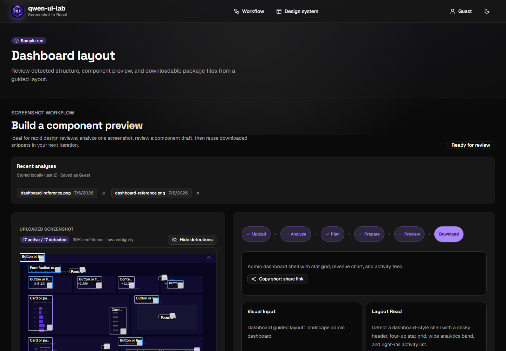

- [Desktop dark](../public/screenshots/A6-Sample-Run/desktop-dark.png)
- [Mobile light](../public/screenshots/A6-Sample-Run/mobile-light.png)

## A7 - Design System

The component catalog and preview canvas for product primitives.

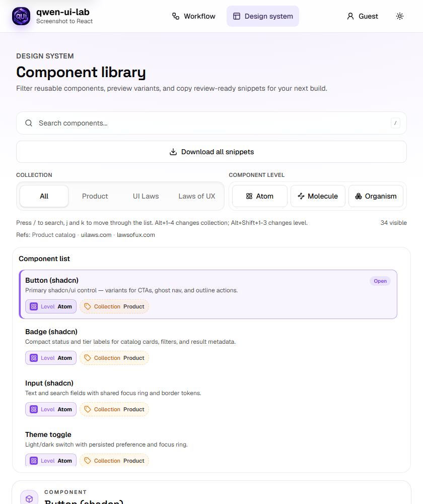

- [Desktop light](../public/screenshots/A7-Design-System/desktop-light.png)
- [Desktop dark](../public/screenshots/A7-Design-System/desktop-dark.png)
- [Tablet light](../public/screenshots/A7-Design-System/tablet-light.png)
- [Mobile dark](../public/screenshots/A7-Design-System/mobile-dark.png)

## A8 - UX Laws

The Laws of UX collection inside the design-system browser.

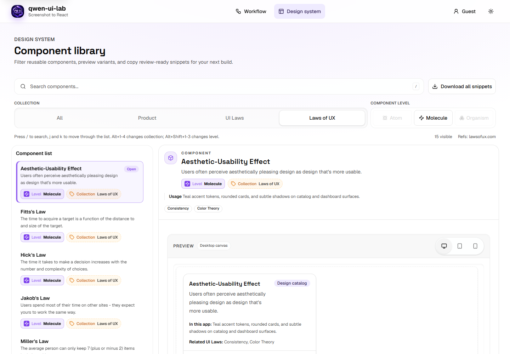

- [Desktop light](../public/screenshots/A8-UX-Laws/desktop-light.png)
- [Mobile dark](../public/screenshots/A8-UX-Laws/mobile-dark.png)

## A9 - Profile Modal

The browser-local profile dialog opened from URL state.

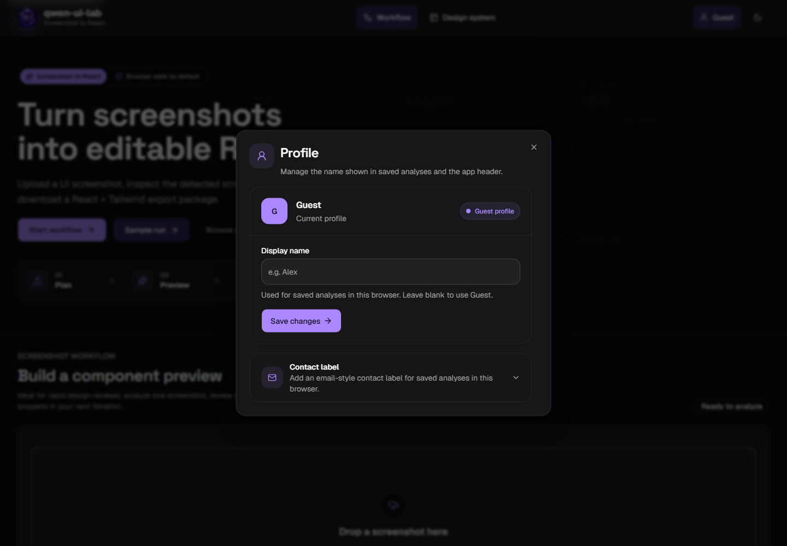

- [Desktop dark](../public/screenshots/A9-Profile-Modal/desktop-dark.png)
- [Mobile light](../public/screenshots/A9-Profile-Modal/mobile-light.png)

## A10 - Share Result

The read-only shared analysis summary and detection preview.

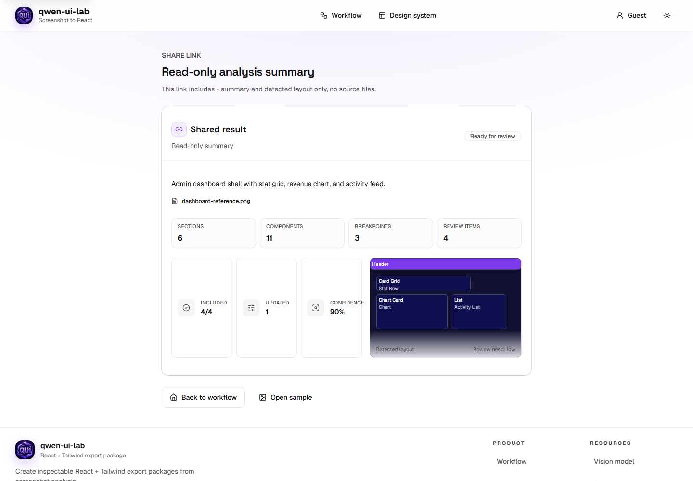

- [Desktop light](../public/screenshots/A10-Share-Result/desktop-light.png)
- [Mobile dark](../public/screenshots/A10-Share-Result/mobile-dark.png)

## A11 - 404 And Recovery

The not-found and unavailable-share recovery surfaces.

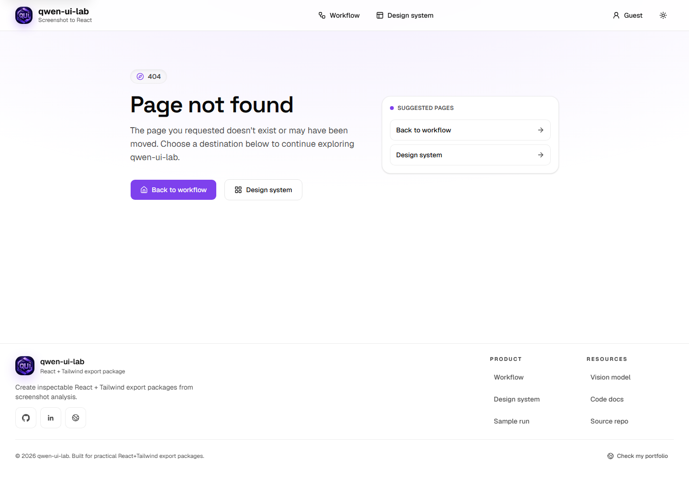

- [Desktop light](../public/screenshots/A11-404-And-Recovery/desktop-light.png)
- [Mobile dark](../public/screenshots/A11-404-And-Recovery/mobile-dark.png)

## A12 - PWA Offline

The static offline fallback used by the service worker.

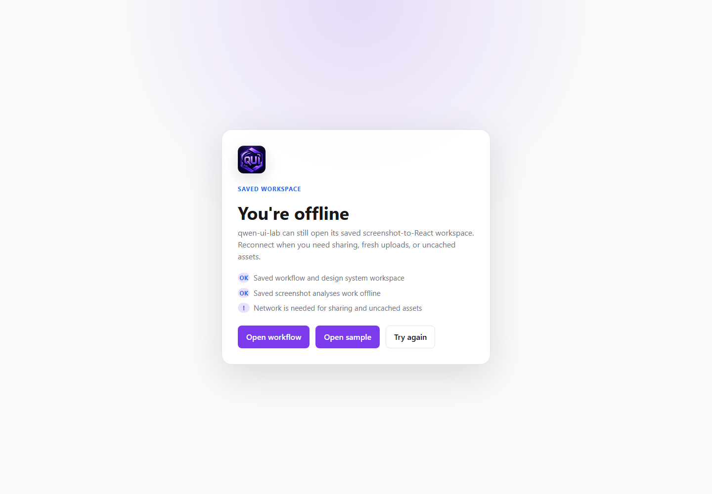

- [Desktop light](../public/screenshots/A12-PWA-Offline/desktop-light.png)
- [Mobile dark](../public/screenshots/A12-PWA-Offline/mobile-dark.png)

