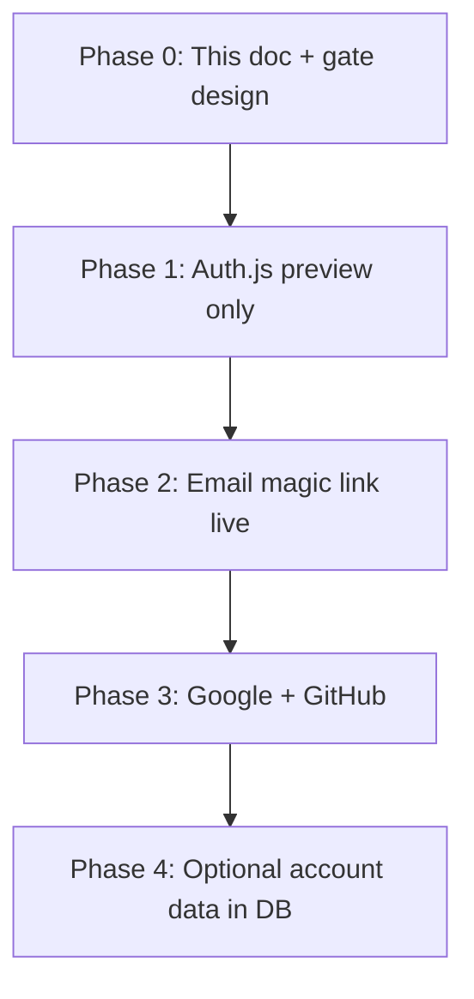

# OAuth & real auth — research spike

**Status:** Research only — no implementation in this doc.  
**Audience:** Engineers planning a demo-safe migration from the current `sessionStorage` account stub to real sign-in (OAuth + magic link email).

## Current state (demo stub)

The `/account` page and header “saved by” label use a **client-only auth stub** with no server session, no cookies, and no outbound network calls.

| Piece | Location | Behavior |
|-------|----------|----------|
| State machine | `src/features/account/lib/auth.mjs` | Modes: `guest` → `named` (display name) or `magic-link-pending` → `named` |
| Persistence | `sessionStorage` key `qwen-ui-lab:auth` | Tab-scoped; cleared on sign-out or empty name |
| React context | `src/features/account/components/AuthProvider.tsx` | `AuthProvider` wraps the app in `layout.tsx` |
| UI | `src/features/account/components/AccountPageClient.tsx` | Display name form + magic-link stub (confirm without token) |
| Consumers | `Header.tsx`, `UploadFlow.tsx` | `savedByLabel`, `signedIn` for demo personalization |
| Tests | `tests/auth.test.mjs`, `e2e/account.spec.ts` | Unit + E2E against sessionStorage |

**Design intent:** Meetup-safe — works offline, no secrets, no email provider, no OAuth app registration. Mirrors the project’s **demo-first / live opt-in** pattern used for Qwen analysis (`QWEN_LIVE_ANALYSIS`).

## Goals for real auth

1. **Google + GitHub OAuth** — familiar providers for developers evaluating the lab.
2. **Magic link email** — passwordless sign-in for users who prefer email.
3. **Demo-safe default** — production meetup URL keeps working with zero auth env vars (stub or read-only guest).
4. **Incremental migration** — preserve `useAuth()` shape where possible; avoid breaking E2E and offline demos.
5. **No secrets in the client** — provider keys and mail API keys server-only (same rule as `DASHSCOPE_API_KEY`).

## Non-goals (for first slice)

- Full user profiles, billing, or multi-tenant workspaces.
- Replacing generated `OAuthButtonRow` scaffolds in analyze output (those stay UI templates).
- Mandatory sign-in for analyze/export (guest must remain viable).

---

## Provider options

### Option A — Auth.js (NextAuth v5) + database adapter

**Stack:** `@auth/core` / `next-auth@5`, Route Handlers under `src/app/api/auth/[...nextauth]/`, optional Drizzle/Prisma adapter.

| Pros | Cons |
|------|------|
| First-class Next.js App Router story; Google/GitHub built-in | You own session storage (DB or JWT strategy) |
| Magic link via Email provider + SMTP/Resend | Email provider config is on you |
| Large ecosystem, familiar to contributors | v5 APIs still evolving; adapter choice matters |
| Can run **Credentials-less** demo mode by not mounting routes when disabled | Middleware/session refresh needs careful CSP |

**Fit:** Best if we want **self-hosted, no vendor lock-in**, and already plan Postgres (e.g. Neon) for future features.

**Env sketch (live only):**

```bash
AUTH_SECRET=…
AUTH_GOOGLE_ID=…
AUTH_GOOGLE_SECRET=…
AUTH_GITHUB_ID=…
AUTH_GITHUB_SECRET=…
EMAIL_SERVER=…          # SMTP or Resend-compatible
EMAIL_FROM=noreply@…
AUTH_ENABLED=true       # proposed gate — see migration
```

### Option B — Clerk

**Stack:** `@clerk/nextjs`, hosted dashboard, middleware `auth()`.

| Pros | Cons |
|------|------|
| Fastest path to Google/GitHub + magic link + UI components | Vendor lock-in; pricing at scale |
| Session, MFA, orgs available later | Custom domain / branding on paid tiers |
| Good Next.js docs | Another third party in the data path |

**Fit:** Best for **speed over control** when the lab needs real auth in days, not weeks.

### Option C — Supabase Auth

**Stack:** `@supabase/ssr`, Supabase project, optional `auth.users` + RLS.

| Pros | Cons |
|------|------|
| OAuth + magic link in one product | Adds Supabase as dependency even if only auth is used |
| PKCE flow documented for App Router | Session cookies + middleware; region/data residency choices |
| Free tier generous for demos | Key rotation and redirect URL management per environment |

**Fit:** Best if we **already want Postgres + storage** (e.g. persisted share links, user-owned scaffolds later).

### Option D — Lucia + Arctic (roll your own OAuth)

**Stack:** `lucia`, `arctic` for OAuth, custom session table, hand-rolled magic-link tokens.

| Pros | Cons |
|------|------|
| Minimal abstraction; full control | Most implementation work |
| No large framework surface | Email delivery, token TTL, CSRF still yours |
| Easy to keep stub and real paths separate | Security review burden on the team |

**Fit:** Best for **learning / minimal deps** — poor match for meetup timeline unless auth is the product.

### Option E — Magic link only (Resend + custom tokens)

**Stack:** Resend (or Postmark) + signed JWT in link + httpOnly session cookie.

| Pros | Cons |
|------|------|
| Smallest OAuth scope | No Google/GitHub without adding providers later |
| Aligns with existing stub UX on `/account` | Token replay, rate limits, and inbox delivery are custom |

**Fit:** Reasonable **phase 1** behind OAuth, or parallel to stub “confirm” button during dev.

---

## Recommendation (spike conclusion)

| Priority | Choice | Rationale |
|----------|--------|-----------|
| **Default path** | **Auth.js v5** | Matches Next.js 16 stack, self-hosted, Google/GitHub/Email providers, no new SaaS bill for meetup demos |
| **Fast alternative** | **Clerk** | If timeline &lt; 1 sprint and vendor OK |
| **Defer** | Lucia-only, magic-link-only | More code for same user-visible outcome |

Proceed with a **spike PR** (separate from this doc) that prototypes Auth.js on a preview deployment with `AUTH_ENABLED=true` only — not on production demo lane until migration steps below are done.

---

## Demo-safe migration strategy

Mirror **[docs/ops/PRODUCTION_DEPLOY_LANE.md](./PRODUCTION_DEPLOY_LANE.md)** — demo-safe by default, live auth opt-in.

### 1. Feature gate (proposed)

| Mode | `AUTH_ENABLED` | Behavior |
|------|----------------|----------|
| **Demo (default)** | unset / `false` | Current `auth.mjs` + `sessionStorage` stub |
| **Live auth** | `true` + provider secrets | Server session; stub UI hidden or read-only fallback |

Optional: `AUTH_DEMO_FALLBACK=true` on preview to show OAuth buttons that noop with a toast (not recommended for production — prefer stub).

Validate in CI with `npm run deploy:env:demo` extended to assert `AUTH_ENABLED` is not set on production.

### 2. Adapter boundary

Introduce a thin **`auth-port`** (name TBD) so `useAuth()` stays stable:

```text
useAuth()  →  auth-port  →  demo: auth.mjs (sessionStorage)
                         →  live: auth-session.server + client hydrate
```

| `AuthContextValue` field | Demo | Live |
|--------------------------|------|------|
| `signedIn` | `mode === "named"` | Valid server session |
| `savedByLabel` | display name or Guest | `user.name` \|\| email local-part \|\| Guest |
| `setDisplayName` | writes sessionStorage | PATCH profile or noop if OAuth-only |
| `sendMagicLinkStub` | local pending state | POST `/api/auth/signin/email` |
| `confirmMagicLink` | stub confirm | handled by callback route |
| `signOut` | clear sessionStorage | Auth.js `signOut()` |

Add fields later (`userId`, `provider`) without breaking demo consumers.

### 3. Phased rollout



| Phase | Scope | Demo impact |
|-------|--------|-------------|
| 0 | Roadmap, env contract, `deploy:env:demo` check | None |
| 1 | Preview deploy, middleware, session cookie | None on prod |
| 2 | Real email magic link | Prod still stub unless flag set |
| 3 | OAuth buttons on `/account` | Prod flag on staging first |
| 4 | Persist preferences server-side | Migration path from sessionStorage export optional |

### 4. SessionStorage coexistence

During transition:

- **Do not** read OAuth tokens from `sessionStorage`.
- On first live login, **ignore** stub state (or offer “merge display name” once).
- E2E: keep `resetE2ESessionStorage()`; add `AUTH_ENABLED=false` in Playwright webServer env so tests never hit real IdP.
- Document `AUTH_SESSION_KEY` deprecation after live auth is default for signed-in users.

### 5. Security checklist (when implementing)

- [ ] `AUTH_SECRET` ≥ 32 bytes; rotate procedure in runbook
- [ ] OAuth redirect URIs: `localhost:3000`, preview `*.vercel.app`, production domain only
- [ ] Magic link: single-use, short TTL, rate limit by IP + email (reuse analyze rate-limit patterns in `analyze-ui-rate-limit-store.mjs`)
- [ ] httpOnly, `Secure`, `SameSite=Lax` session cookies
- [ ] CSP updates — see **[docs/ops/CSP_HARDENING_GUIDE.md](./CSP_HARDENING_GUIDE.md)** for auth callback origins
- [ ] No PII in analytics events — see **[docs/ops/ANALYTICS_TAXONOMY.md](./ANALYTICS_TAXONOMY.md)**

### 6. UI / i18n

- `/account` already describes demo behavior in EN/ZH dictionaries (`src/lib/i18n/dictionaries/*`).
- When live: add copy for “Sign in with Google/GitHub” and real magic-link sent state; keep guest CTA for analyze flow.
- Generated auth archetype (`/demo?archetype=auth`) remains a **visual scaffold** — not wired to real OAuth until explicitly productized.

---

## OAuth app registration (ops notes)

| Provider | Redirect URI pattern | Notes |
|----------|---------------------|--------|
| Google | `https://<host>/api/auth/callback/google` | OAuth consent screen; test users while in verification |
| GitHub | `https://<host>/api/auth/callback/github` | Separate OAuth apps per env recommended |

Store client IDs as env vars; never `NEXT_PUBLIC_*` for secrets.

---

## Email magic link (ops notes)

| Provider | Integration | Meetup demo |
|----------|-------------|-------------|
| Resend | Auth.js Email provider or custom | Free tier; domain verification required |
| Postmark | SMTP `EMAIL_SERVER` | Transactional focus |
| SendGrid | SMTP | Heavier setup |

For local dev: Mailpit/Mailhog SMTP on `localhost:1025` — same pattern as share-link KV optional backend.

---

## Testing strategy (future implementation)

| Layer | Demo (`AUTH_ENABLED=false`) | Live (preview) |
|-------|----------------------------|----------------|
| Unit | Keep `tests/auth.test.mjs` for stub | Add adapter mocks |
| E2E | `e2e/account.spec.ts` unchanged | Separate tagged spec or mocked OAuth |
| Contract | N/A | Smoke: `GET /api/auth/session` returns 401 when logged out |

---

## Open questions

1. **User data model** — session only vs `users` table for saved scaffolds / gist ownership?
2. **Clerk vs Auth.js** — decision deadline before Phase 1 spike?
3. **Required sign-in** — any route (`/admin/analytics`?) should stay public-demo or gain optional auth?
4. **Vercel preview** — shared OAuth app with wildcard redirect vs per-preview secrets?
5. **GDPR / delete account** — scope for v1?

---

## Related docs

- **[docs/ops/PRODUCTION_DEPLOY_LANE.md](./PRODUCTION_DEPLOY_LANE.md)** — demo vs live env policy (model for `AUTH_ENABLED`)
- **[docs/ops/CSP_HARDENING_GUIDE.md](./CSP_HARDENING_GUIDE.md)** — CSP when adding auth callbacks
- **[docs/ops/OFFLINE_DEMO_E2E.md](./OFFLINE_DEMO_E2E.md)** — offline guarantees E2E must preserve
- **[DEMO.md](../DEMO.md)** — meetup script; `/account` is optional, not on critical path

## References

- [Auth.js — Getting started (Next.js)](https://authjs.dev/getting-started/installation?framework=next.js)
- [Auth.js — Google provider](https://authjs.dev/getting-started/providers/google)
- [Auth.js — GitHub provider](https://authjs.dev/getting-started/providers/github)
- [Auth.js — Nodemailer / email](https://authjs.dev/getting-started/authentication/email)
